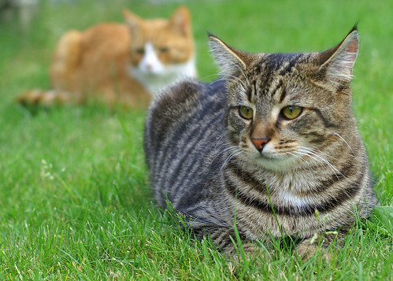
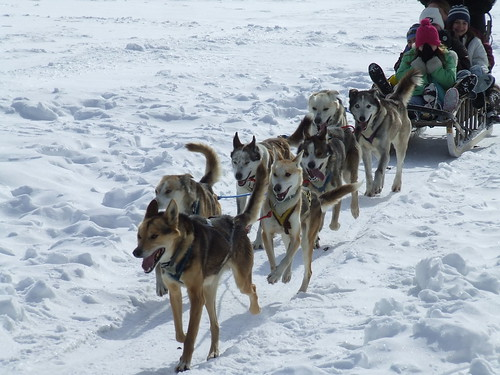
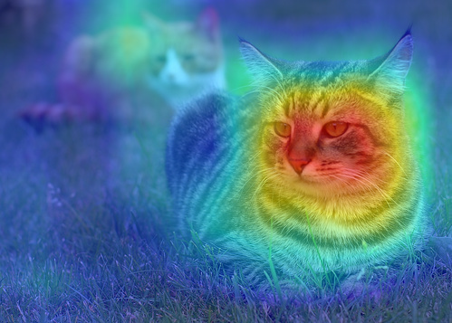
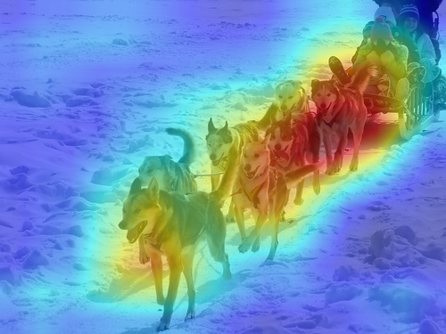
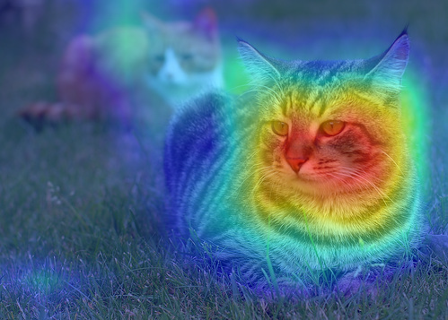
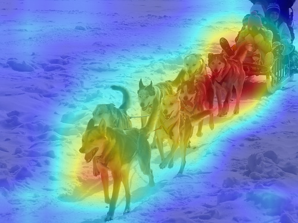
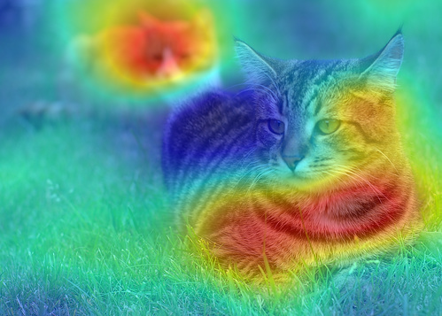
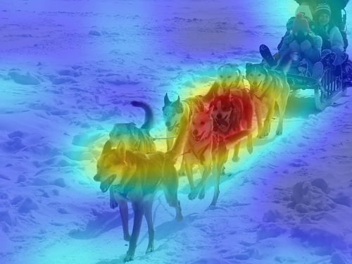

# Smooth Grad-CAM++ with pytorch
The re-implementation of Smooth Grad-CAM++ with pytorch.
This repo also includes the code of CAM, Grad-CAM and Grad-CAM++.

## Requirements
* python 3.x
* pytorch >= 0.4
* pillow
* numpy
* opencv
* matplotlib

## How to use
You can use the CAM, GradCAM, GradCAM++ and Smooth Grad-CAM++ as a model wrapper described in `cam.py`.
Please see `demo.ipynb` for the detail.

# Results
|image|||
|:-:|:-:|:-:|
|CAM|||
|Grad-CAM|||
|RISE|||

## References
* RISE: Randomized Input Sampling for Explanation of Black-box Models,  
  Vitali Petsiuk, Abir Das, Kate Saenko, In BMVC 2018 [[paper](https://arxiv.org/abs/1806.07421)] [[official code](https://github.com/eclique/RISE)]
* Learning Deep Features for Discriminative Localization, 
  Bolei Zhou, Aditya Khosla, Agata Lapedriza, Aude Oliva, Antonio Torralba, In CVPR2016 [[paper](http://cnnlocalization.csail.mit.edu/Zhou_Learning_Deep_Features_CVPR_2016_paper.pdf)]
* Grad-CAM: Visual explanations from deep networks via gradient-based localization,
  Ramprasaath R. Selvaraju, Michael Cogswell, Abhishek Das, Ramakrishna Vedantam, Devi Parikh, Dhruv Batra, [[arXiv](https://arxiv.org/abs/1610.02391)]
